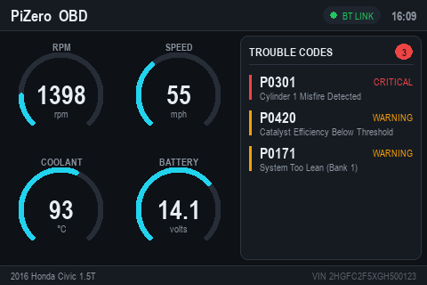

# PiZero OBD Dashboard

A fullscreen car-diagnostics display for the goodtft **3.5" TFT (480×320)** on a
Raspberry Pi Zero. Shows live gauges (RPM, speed, coolant, battery) and stored
diagnostic trouble codes (DTCs).

Runs on **dummy data out of the box** so you can see the design immediately.
Swapping in a real Bluetooth ELM327 adapter is a drop-in change (see below).



> **Deployed and verified** on the Pi (`admin@pizero`) as a systemd service:
> renders on `/dev/fb1`, ~10 fps, **~30% CPU**, ~40 °C.

## How it drives the TFT

This Pi's SDL2 build has no `fbcon`/`kmsdrm` driver for the ili9486 SPI panel, so
the app renders to an offscreen surface with the `dummy` video driver and writes
raw **RGB565** frames straight to `/dev/fb1` (`FramebufferOutput` in
`dashboard.py`). To stay light on the single-core ARMv6, the static chrome is
baked into one background surface, the value arcs are pre-rendered per level as
colorkey blits, and rendered numbers are cached — see `widgets.py`.

## Files

| File            | Purpose                                             |
|-----------------|-----------------------------------------------------|
| `dashboard.py`  | Main app + layout + render loop                     |
| `datasource.py` | `VehicleData`/`DTC` model, `DummyDataSource`, OBD stub |
| `widgets.py`    | Draw helpers: arc gauges, DTC panel, header/footer  |
| `theme.py`      | Colors, fonts, screen geometry                      |

## Run

On the Pi (auto-detects `/dev/fb1` and writes frames to the TFT):

```bash
sudo apt install -y python3-pygame        # or: pip3 install -r requirements.txt
python3 dashboard.py            # or: python3 dashboard.py --fb /dev/fb1
```

On a desktop, to preview the design in a window:

```bash
python3 dashboard.py --windowed
```

Press **ESC** or **Q** to quit.

## Autostart on boot

This is **already installed** on the Pi. The service unit
(`/etc/systemd/system/obd-dash.service`) is:

```ini
[Unit]
Description=PiZero OBD Dashboard
After=multi-user.target

[Service]
User=admin
WorkingDirectory=/home/admin/obd-dash
ExecStart=/usr/bin/python3 /home/admin/obd-dash/dashboard.py --fb /dev/fb1
Restart=always
RestartSec=2

[Install]
WantedBy=multi-user.target
```

Manage it with:

```bash
sudo systemctl restart obd-dash     # after copying new code over
sudo systemctl status obd-dash
journalctl -u obd-dash -f           # live logs
```

> The `--fb` device defaults to `/dev/fb1` (the TFT created by `LCD35-show`;
> `/dev/fb0` is HDMI). If the screen stays blank, check `ls /dev/fb*` and
> `dmesg | grep fb`, then pass the right device to `--fb`.

## Connecting a real adapter (later)

The UI only depends on the `DataSource` interface, so real data drops in cleanly:

1. `pip3 install obd`
2. Pair the ELM327 and bind it to a serial device:
   ```bash
   sudo rfcomm bind rfcomm0 <ADAPTER_MAC> 1
   ```
3. Uncomment the `OBDDataSource` class at the bottom of `datasource.py`.
4. In `dashboard.py`, swap `DummyDataSource()` for `OBDDataSource("/dev/rfcomm0")`.

Nothing in the rendering code changes.
